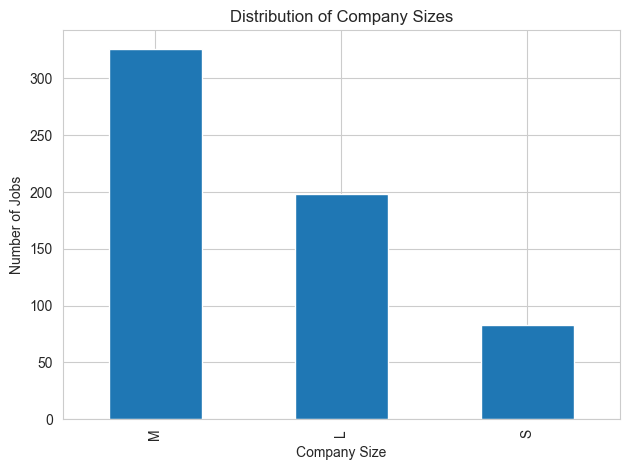
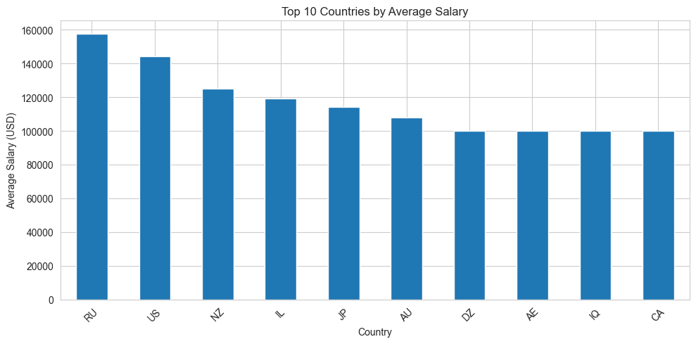

# 📊 Job Market Analysis | Data Science Salary Insights

## 📌 Project Overview
This project analyzes global data science job market trends to understand salary patterns, job roles, company sizes, experience levels, and remote work opportunities.

The project uses **Python and SQL** to clean, analyze, and extract meaningful insights from job market data.

---

## 🎯 Objectives
- Analyze salary trends across different data science roles
- Identify high-demand job positions
- Understand the impact of experience level on salaries
- Compare salaries across different locations
- Analyze company size distribution

---

## 🛠️ Tools & Technologies Used

- Python
  - Pandas
  - Matplotlib
  - Data Analysis

- SQL
  - Filtering
  - Aggregation
  - Group By Queries

- Jupyter Notebook

---

## 📂 Dataset Information

The dataset contains information about data science jobs including:

- Job title
- Experience level
- Employment type
- Company size
- Company location
- Salary information
- Remote work ratio

---

## 🔍 Analysis Performed

### Python Analysis
- Data cleaning and preprocessing
- Exploratory Data Analysis (EDA)
- Salary analysis
- Job role distribution analysis
- Company size analysis
- Location-based salary analysis

### SQL Analysis
Used SQL queries to answer business questions:

- Most common job roles
- Highest paying job positions
- Salary comparison by experience level
- Company size distribution
- Location-wise salary analysis

---

## 📈 Key Insights

- Data Scientist and Data Engineer roles are among the most common roles.
- Senior-level positions generally have higher salaries.
- Salary varies significantly based on company location.
- Medium-sized companies have a large share of opportunities.

---

## 📁 Project Files

| File | Description |
|------|-------------|
| `Job_Market_Analysis.ipynb` | Python analysis and visualizations |
| `Job_Market_Analysis_SQL.sql` | SQL queries used for analysis |
| `ds_salaries.csv` | Dataset used for analysis |

---

## 📊 Project Visualizations

### Company Size Distribution

### Salary Analysis

---

## 🚀 Skills Demonstrated

- Exploratory Data Analysis
- Data Cleaning
- Data Visualization
- SQL Query Writing
- Business Insights Generation

---

## 👩‍💻 Author

**Vyshnavi Jangili**
